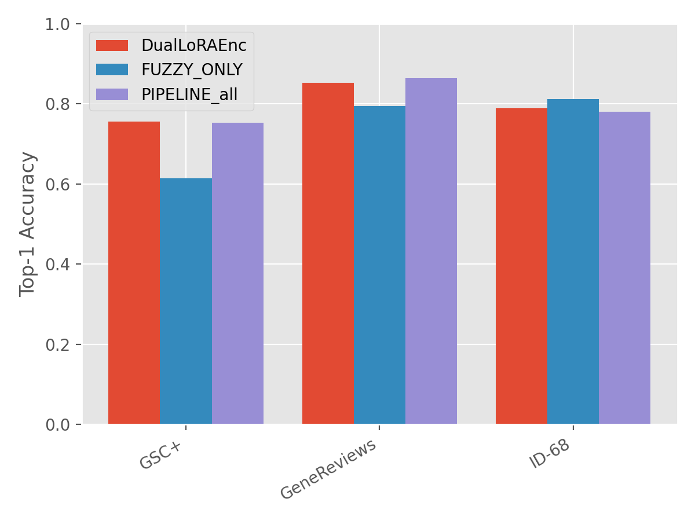
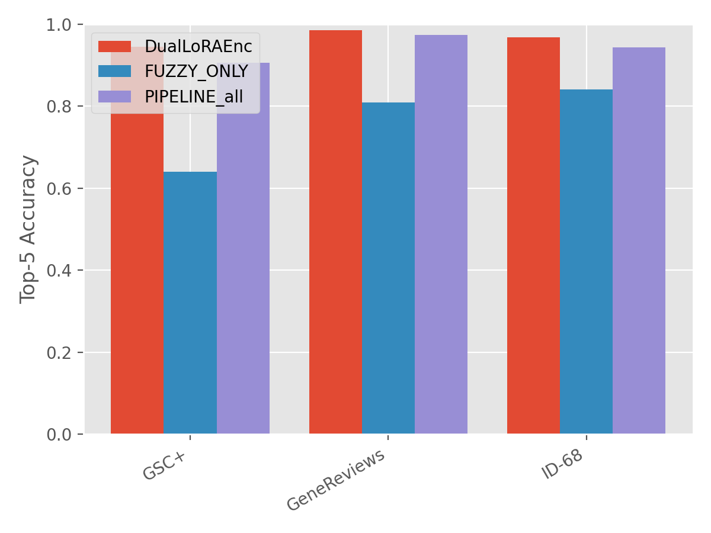
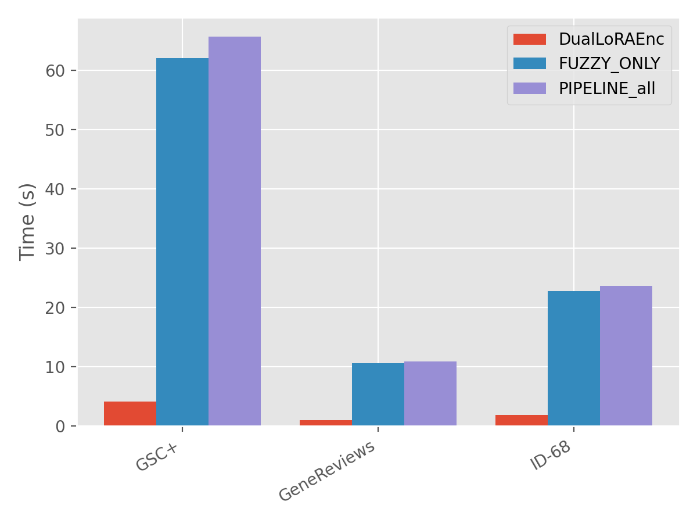
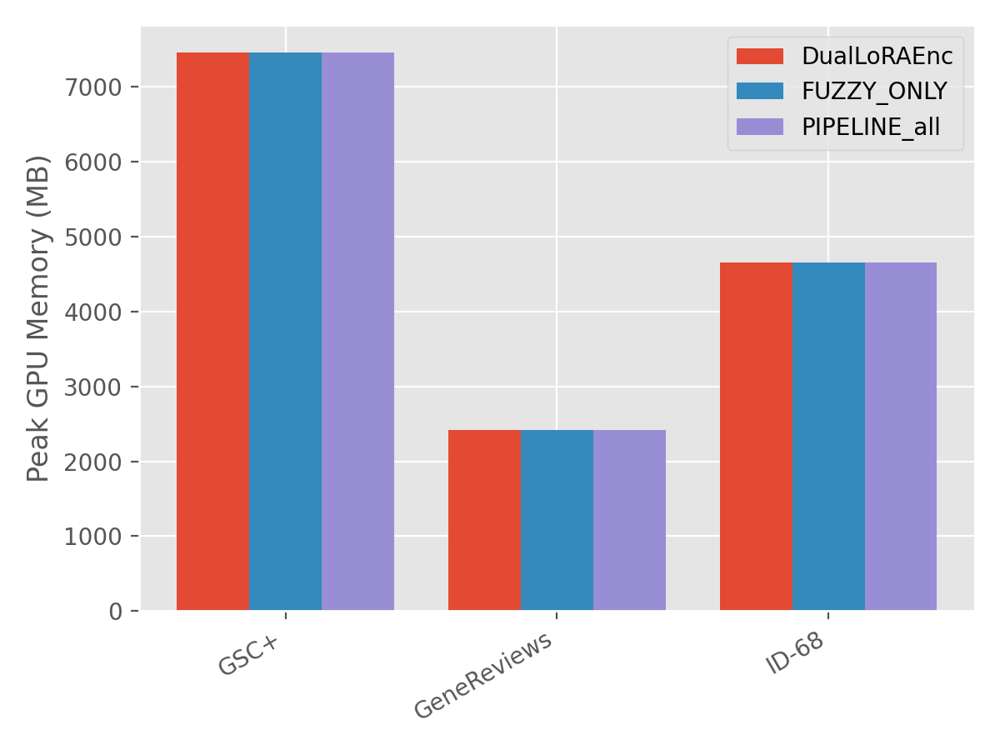
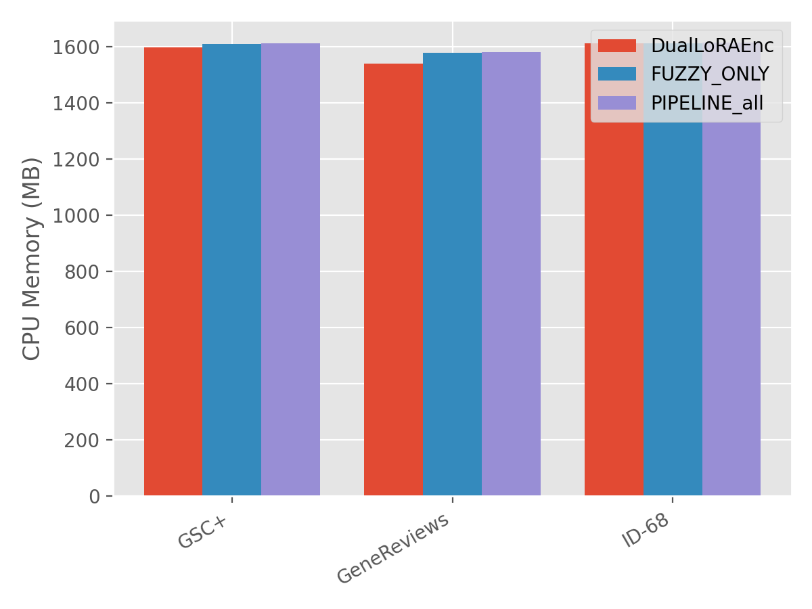
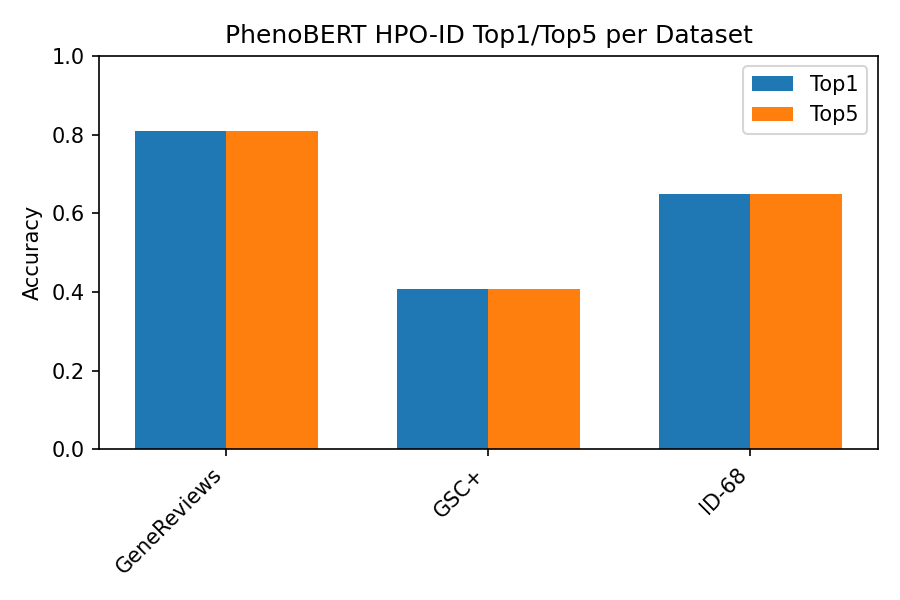
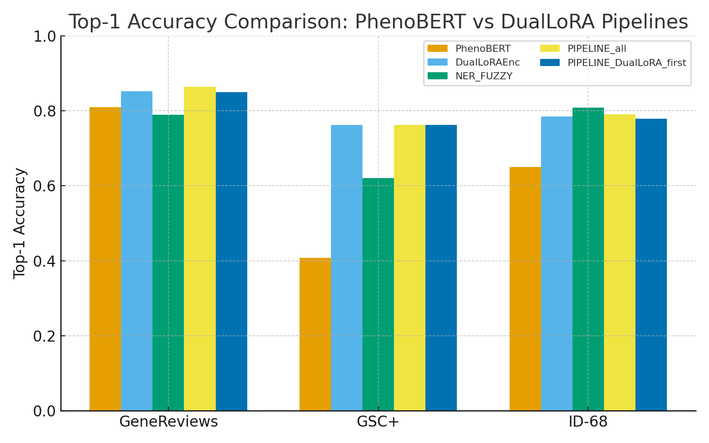
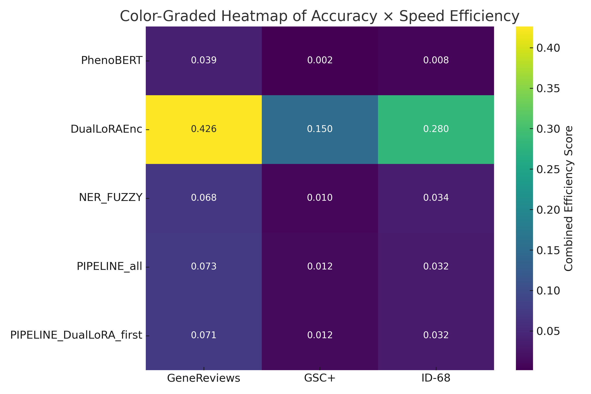
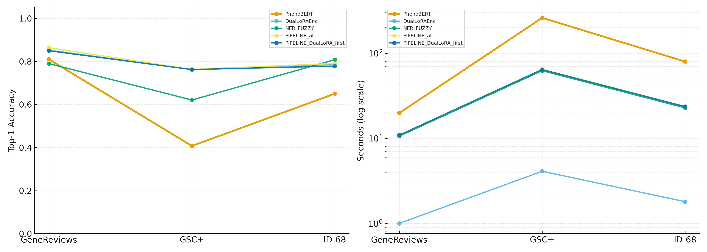
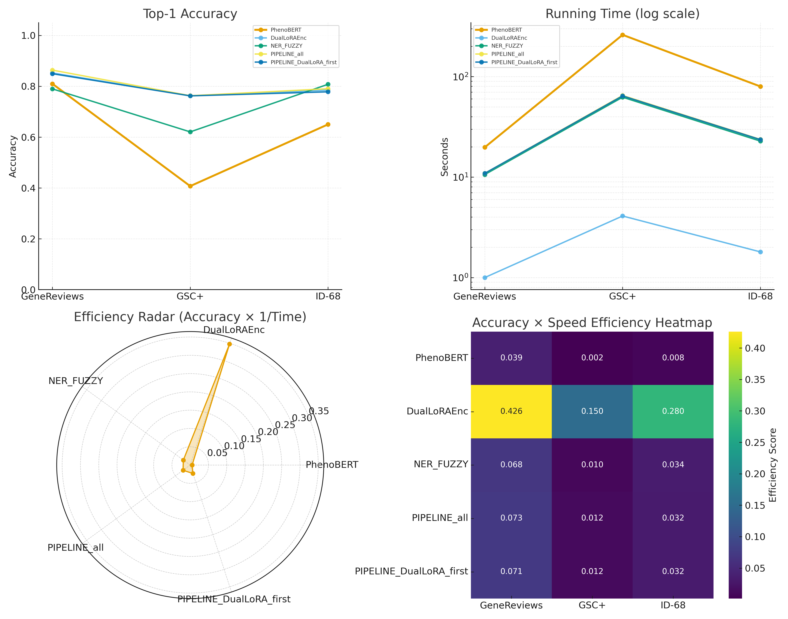

# AquaFlow-HPO: DualLoRAEnc-based HPO NER & Span-Contrastive Mapping

**MEDIS Lab – Clinical Phenotype Mining & Biomedical NLP**

AquaFlow-HPO is an open-source Human Phenotype Ontology (HPO) extraction and grounding system.
It integrates:

* **Span-level NER** (BIOES + CRF)
* **DualLoRAEnc span encoder** trained with span-contrastive objectives
* **Hybrid pipeline retrieval (Semantic + Fuzzy + Exact)**
* **Ontology-aware hierarchical reranking**
* **Interactive web demo** for real-time HPO detection and grounding

This repository contains:

1. **The HPO NER web demo** (`ruoshui_webdemo.py`, `html/dualenc.html`)
2. **DualLoRAEnc span-contrastive evaluation utilities**
3. **Benchmark comparisons against classical PhenoBERT**
4. **All performance figures (Top-1/Top-5/Recall/Time/Mem)** in `img/`

---

# 📁 Project Structure


```
HPO/
│
├── web/
│   ├── dataset/                # Evaluation corpora (HPO span-pairs)
│   │   ├── GeneReviews/
│   │   ├── GSC+/
│   │   └── ID-68/
│   │
│   ├── model/                  # Ontology, pretrained models, checkpoints
│   │   ├── data/hpo.json
│   │   ├── models/BioLinkBERT-base/
│   │   └── tuned/
│   │       ├── hpo_lora_onto_Dhead/best/
│   │       ├── intention/
│   │       └── hpoid_span_contrastive/hpoid_span_best.pt
│   │
│   ├── html/
│   │   └── dualenc.html        # Frontend UI
│   │
│   ├── ruoshui_webdemo.py      # Main backend
│   ├── ruoshui_webdemo_inv.py  # Optional inverted demo
│   ├── train_hpoid_span_contrastive.py
│   └── hpo_lora_hpoid.py
│
└── img/                        # All evaluation figures
    ├── perf_top1.png
    ├── perf_top5.png
    ├── perf_time.png
    ├── perf_gpu_mem.png
    ├── perf_cpu_mem.png
    ├── phenobert_eval_results.png
    ├── top1_grouped_bar.png
    ├── heatmap_accuracy_speed.png
    ├── multipanel_clean.png
    └── four_panel_compare.png
```

---

# 🚀 1. HPO Span-Contrastive Evaluation

## 🔧 Command

```
python eval_hpoid_span_contrastive.py \
  --eval_roots  data/GeneReviews \
  --eval_roots  data/GSC+ \
  --eval_roots  data/ID-68 \
  --hpo_json  data/hpo.json \
  --model_dir  tuned/hpo_lora_onto_Dhead/best \
  --backbone  models/BioLinkBERT-base \
  --init_encoder_from  tuned/intention \
  --out_dir  VAL \
  --ckpt_path  tuned/hpoid_span_contrastive/hpoid_span_best.pt \
  --batch_size 32 \
  --max_len 512 \
  --seed 42 \
  --stageA_topk 15
```

---

# 📊 2. Results Summary

## 🟦 DualLoRAEnc vs NER_FUZZY vs PIPELINE_all

| Dataset     | Mode         | RecallA@15 |       Top1 |       Top5 | Time (s) | GPU MB | CPU MB |
| ----------- | ------------ | ---------: | ---------: | ---------: | -------: | -----: | -----: |
| GeneReviews | DualLoRAEnc  |          - | **0.8523** | **0.9858** |  **1.0** |   2422 |   1541 |
| GeneReviews | NER_FUZZY    |     0.8097 |     0.7955 |     0.8097 |     10.6 |   2422 |   1577 |
| GeneReviews | PIPELINE_all | **0.9830** |     0.8636 |     0.9744 |     10.9 |   2422 |   1581 |
| GSC+        | DualLoRAEnc  |          - |     0.7565 |     0.9457 |      4.2 |   7455 |   1599 |
| GSC+        | NER_FUZZY    |     0.6407 |     0.6138 |     0.6407 |     62.0 |   7455 |   1609 |
| GSC+        | PIPELINE_all | **0.9376** |     0.7536 |     0.9063 |     65.6 |   7455 |   1613 |
| ID-68       | DualLoRAEnc  |          - |     0.7890 |     0.9677 |      1.8 |   4652 |   1612 |
| ID-68       | NER_FUZZY    |     0.8414 |     0.8118 |     0.8414 |     22.7 |   4652 |   1613 |
| ID-68       | PIPELINE_all | **0.9745** |     0.7809 |     0.9435 |     23.6 |   4652 |   1613 |

### 📈 Visualizations












---
# 🌐 3. Ruoshui: HPO NER Web Demo

A realtime HPO extraction and grounding demo.

## Run the backend

```
cd web
python ruoshui_webdemo.py
```

Server starts at:

```
http://127.0.0.1:8008/
```

## Supported Modes

* `duallora` – **Pure DualLoRAEnc semantic retrieval**
* `fuzzy` – Exact + RapidFuzz only
* `pipeline` – **Two-stage Hybrid:**

  1. DualLoRAEnc global **Top-K recall**
  2. Fuzzy+Exact refinement *inside* the candidate pool

---

# 📜 5. License

MIT License © MEDIS Lab

---

# 🤝 6. Citation

If you use AquaFlow-HPO in your research, please cite:

```
@inproceedings{medislab2025aquaflowhpo,
  title={AquaFlow-HPO: DualLoRAEnc Span-Contrastive Human Phenotype Ontology Grounding},
  author={MEDIS Lab},
  year={2025},
  institution={MEDIS Lab}
}
```

